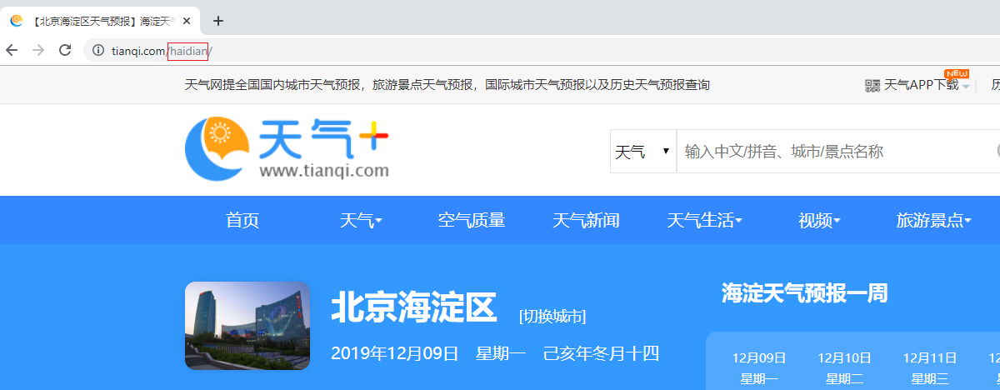

## removeHTMLTag

直接运行：

```bash
python3 removeHTMLTag.py ./test.txt
```

## gitlabAutoRegistry

安装依赖：

```bash
pip3 install selenium
```

运行程序：

```bash
python3 gitlabAutoRegistry.py ./info.txt
```

其中 `info.txt` 为注册信息，格式为**用户名 + TAB符 + 密码**，例如：

```
zhangsan	123456
lisi	2567898
```

## weather

修改程序 Line 12 邮箱用户名、密码、SMTP Host 和端口信息。以 QQ 邮箱为例：

```properties
user = sample@qq.com
password = 开启 SMTP 服务后的密码（16位字符串）
host = smtp.qq.com
port = 465
```

安装依赖：

```bash
pip3 install pandas
pip3 install yagmail
pip3 install requests
pip3 install lxml
```

运行程序：

```bash
python3 weather.py 城市拼音 收件人
```

例如：

```bash
python3 weather.py beijing sample@qq.com
```

其中城市拼音请在 `https://www.tianqi.com` 网站查询。

